# What's New

Stay up to date with every PyTrendy release — user-facing improvements, bug fixes, and behaviour changes.

!!! note "Pre-release documentation"
    You are viewing the **develop** (pre-release) build.  
    The section at the top reflects changes staged for the next stable release.  
    Switch to the **main** docs via the badge in the header to see only stable content.

---

<!-- WHATS_NEW_CONTENT_START -->

## Upcoming Changes (v1.2.0 pre-release) <span class="version-prerelease">in development</span>

*Staged on the `develop` branch — will land in the next stable release.*

To try it now: `pip install --pre pytrendy`

Four updates are landing in the next stable release: an agentic docs generator, a new noise toggle, and two fixes to trend metrics and normalised input handling.

??? note "Automated What's New — agentic docs generator"
    The What's New page itself is now generated by an AI agent. A GitHub Actions workflow
    ([`whats-new.yaml`](https://github.com/RussellSB/pytrendy/blob/develop/.github/workflows/whats-new.yaml))
    fires automatically whenever a GitHub Release is published. It invokes
    [`scripts/generate_whats_new.py`](https://github.com/RussellSB/pytrendy/blob/develop/scripts/generate_whats_new.py),
    which calls the **GitHub Models API** (Claude Sonnet 4) to write a user-friendly What's New entry
    from the release notes, then opens a pull request for review.
    Introduced: [#120](https://github.com/RussellSB/pytrendy/pull/120)

    Key behaviours:

    - Pre-releases (from `develop`) add a collapsible entry to the **Upcoming Changes** section.
    - Stable releases (from `main`) add a versioned entry and open a sync PR back to `develop`.
    - Code examples reference GitHub raw URLs (`develop` for pre-release, `main` for stable) so they are always reproducible.
    - Within each section, fixes and features are listed in **descending time order** (most recent at the top).
    - Before/after plot comparisons use `plot_pytrendy(df, value_col, segments, suppress_show=True)` — this ensures a consistent `figsize=(20, 5)`, weekly grid, and legend across all images so they are directly comparable.
    - Agent instructions embedded in the script docstring remind the generator to verify that referenced CSV files still exist before each refresh.

??? note "Noise detection control (`avoid_noise`)"
    A new `avoid_noise` parameter in `method_params` lets users opt out of noise detection entirely.
    When set to `False`, spikes and noisy regions are ignored and trend detection proceeds straight through them.
    Introduced: [#110](https://github.com/RussellSB/pytrendy/pull/110)

    Useful for modelling a new-market launch or quasi-experiment where the signal is zero before and
    after the activation window. With `avoid_noise=False`, boundary artifacts around step-changes are
    suppressed, yielding clean Up/Down segments.

    <div class="before-after-grid" markdown>
    <div class="before-after-panel" markdown>
    <span class="before-after-label before-label">Before — `avoid_noise=True` (default)</span>

    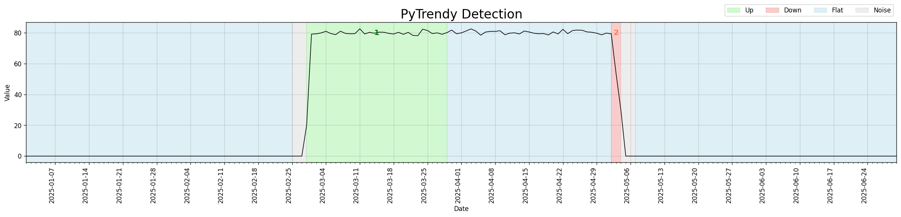

    </div>
    <div class="before-after-panel" markdown>
    <span class="before-after-label after-label">After — `avoid_noise=False`</span>

    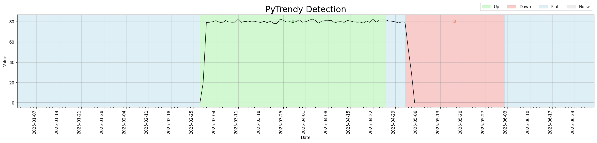

    </div>
    </div>

    ??? example "Code"
        ```python
        import pytrendy as pt

        df = pt.load_data("series_synthetic")
        df.set_index("date", inplace=True)
        # Simulate a new-market / quasi-experiment: zero activity before and after activation
        df.loc["2025-01-01":"2025-02-27", "abrupt"] = 0
        df.loc["2025-05-05":"2025-06-30", "abrupt"] = 0
        df = df.reset_index()

        result = pt.detect_trends(
            df, date_col="date", value_col="abrupt",
            method_params=dict(is_abrupt_padded=True, avoid_noise=False)
        )
        print(result.df[["direction", "start", "end"]])
        ```

??? note "Metrics for all segment types"
    Segment metrics (`pct_change`, `change_rank`) were not computed for every trend type.
    All output rows now carry complete metric columns regardless of classification.
    Fix: [#88](https://github.com/RussellSB/pytrendy/issues/88)

    | direction | start | end | pct_change | change_rank |
    |---|---|---|---|---|
    | <span style="color:#15803d;font-weight:600">Up</span> | 2000-01-01 | 2000-05-01 | **+42%** | 1 |
    | <span style="color:#b91c1c;font-weight:600">Down</span> | 2000-06-16 | 2000-12-31 | **−38%** | 2 |
    | <span style="color:#1e6e9f;font-weight:600">Flat</span> | 2000-05-02 | 2000-06-15 | +0% | 3 |

    *Before v1.1.11, all three columns were `NaN` for Flat (and Noise) segments. Ranked by `change_rank`.*

    ??? example "Code"
        ```python
        import pandas as pd
        import pytrendy as pt

        url = "https://raw.githubusercontent.com/RussellSB/pytrendy/develop/tests/tests_crashes_edgecases/data/low_value_series.csv"
        df = pd.read_csv(url)
        result = pt.detect_trends(df, date_col="date", value_col="trend", plot=False)
        print(result.df[["direction", "pct_change", "change_rank"]])
        ```

??? note "Trend detection on normalised time series"
    `detect_trends()` previously returned an empty result when the input signal was scaled to the
    `[0, 1]` range (e.g., after min-max normalisation). The absolute detection threshold was too large
    relative to the signal amplitude — causing the algorithm to detect nothing, which the flat fill-in
    logic then represented as a single all-Flat series.
    Fix: [#79](https://github.com/RussellSB/pytrendy/pull/79)

    <div class="before-after-grid" markdown>
    <div class="before-after-panel" markdown>
    <span class="before-after-label before-label">Before — v1.1.10</span>

    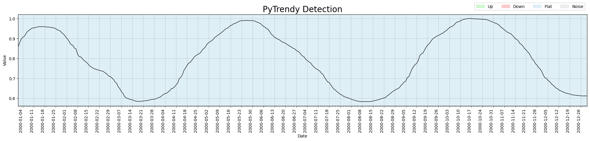

    </div>
    <div class="before-after-panel" markdown>
    <span class="before-after-label after-label">After — v1.1.11</span>

    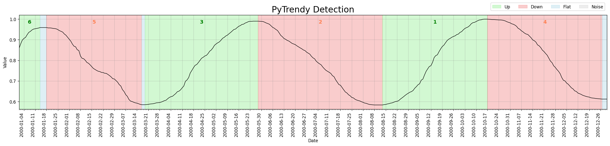

    </div>
    </div>

    The same normalised series now returns a correctly detected Up / Flat / Down sequence.
    Regression test: [`test_low_value_series`](https://github.com/RussellSB/pytrendy/blob/develop/tests/tests_crashes_edgecases/test_uncommon_values.py)

    ??? example "Code"
        ```python
        import pandas as pd
        import pytrendy as pt

        url = "https://raw.githubusercontent.com/RussellSB/pytrendy/develop/tests/tests_crashes_edgecases/data/low_value_series.csv"
        df = pd.read_csv(url)
        result = pt.detect_trends(df, date_col="date", value_col="trend")
        print(result.df[["start", "end", "direction"]])
        ```

---

## Noise Detection & Robustness (v1.1.3 – v1.1.10)

A sustained series of improvements to noise detection, spike precision, and edge-case
stability — making the algorithm significantly more reliable on real-world noisy signals.

### Released in v1.1.10

> Released 2026-03-21

Comprehensive automated tests added for noise edge cases and crash scenarios — full coverage for the noise detection module. ([#46](https://github.com/RussellSB/pytrendy/issues/46))

??? note "Details"
    - Automated tests for noise crashes (`test_noise_crashes.py`) and edge cases (`test_noise_edgecases.py`).
    - Artifact-cleaning helpers refactored to be more testable and deterministic.
    - Several `pytest-mpl` baseline images corrected.

---

### Released in v1.1.8 and v1.1.9

> v1.1.8 — 2025-11-15 · v1.1.9 — 2026-02-07

Targeted improvements to noise detection precision and flat segment handling. ([v1.1.8: tag](https://github.com/RussellSB/pytrendy/releases/tag/v1.1.8) · [v1.1.9: #42](https://github.com/RussellSB/pytrendy/issues/42))

??? note "Flat fill-in improvements (v1.1.8)"
    Building on the flat fill-in first introduced in v1.1.0, v1.1.8 extended coverage to two additional edge cases:

    - **Trailing / leading regions**: if the detected segments don't span the full series range, the uncovered leading or trailing period is now filled in with a Flat segment.
    - **Robustness to grouping**: zero-day boundary regions are safely skipped; grouped segments no longer produce gaps.

    The before/after below shows three spikes distributed across a gradual series. In v1.1.7, the period after the last Noise segment (2025-06-18 → 2025-06-30) was left uncoloured. In v1.1.8 it is correctly filled as Flat.

    <div class="before-after-grid" markdown>
    <div class="before-after-panel" markdown>
    <span class="before-after-label before-label">Before — v1.1.7</span>

    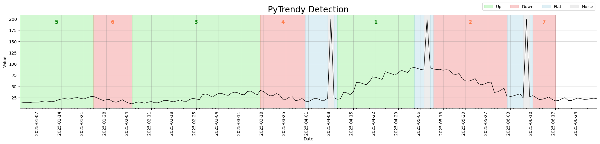

    </div>
    <div class="before-after-panel" markdown>
    <span class="before-after-label after-label">After — v1.1.8</span>

    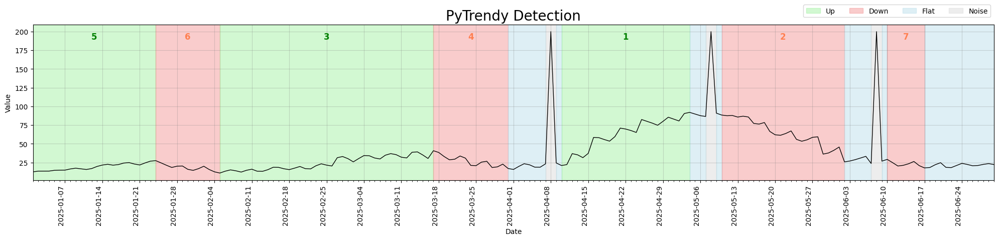

    </div>
    </div>

    Regression test: [`test_gradual_four_spikes_distributed_flatfillins`](https://github.com/RussellSB/pytrendy/blob/develop/tests/test_noise_spikes_gradual.py)

    ??? example "Code"
        ```python
        import pandas as pd
        import pytrendy as pt

        df = pt.load_data("series_synthetic")
        df["date"] = pd.to_datetime(df["date"])
        df.set_index("date", inplace=True)
        df.loc["2025-04-08":"2025-04-08", "gradual"] = 200
        df.loc["2025-05-08":"2025-05-08", "gradual"] = 200
        df.loc["2025-06-08":"2025-06-08", "gradual"] = 200
        df = df.reset_index()
        pt.detect_trends(df, date_col="date", value_col="gradual",
                         method_params=dict(is_abrupt_padded=True))
        ```

??? note "Noise detection (v1.1.8)"
    - Better precision for a spike on an otherwise flat-zero signal.
    - Improved sensitivity when flat conversions emerge from noisy gradual trends.
    - `trend_too_flat` now treated as a flat conversion rather than noise.
    - Up/down classification uses the actual signal (not the smoothed derivative), reducing downstream artifact-cleaning needs.
    - Gradual trends enclosed in noise are handled more leniently.
    - Noise adjustment for contract logic now crops correctly before start/end boundary checks.

??? note "Spike precision (v1.1.9)"
    Further improvement to spike detection precision for signals with a single dominant outlier surrounded by otherwise stable values. ([#42](https://github.com/RussellSB/pytrendy/issues/42))

---

### Released in v1.1.3 – v1.1.7

> v1.1.3 — 2025-10-16 · v1.1.4 — 2025-10-19 · v1.1.5 — 2025-10-22 · v1.1.6 — 2025-10-23 · v1.1.7 — 2025-11-01

A focused series of noise detection improvements, from an initial major revamp through to edge-case tuning and stability fixes.

??? note "v1.1.7 — expand-contract & noise stability"
    ([tag v1.1.7](https://github.com/RussellSB/pytrendy/releases/tag/v1.1.7))

    - **Expand-contract:** gradual trends can now be retroactively updated when a newer gradual changes the reference baseline. ([a99c30f](https://github.com/RussellSB/pytrendy/commit/a99c30f))
    - **Noise detection:** resolved edge cases around abrupt-noise boundaries, opposite-direction overlaps, and post-grouping validity checks. ([9b41189](https://github.com/RussellSB/pytrendy/commit/9b41189), [06aa45c](https://github.com/RussellSB/pytrendy/commit/06aa45c))
    - **Plot:** visual displacement is only applied when it does not break the up/down direction contract. ([7ae27ad](https://github.com/RussellSB/pytrendy/commit/7ae27ad))

??? note "v1.1.6 — noise threshold tuning"
    Made the noise threshold slightly less sensitive to avoid false positives on near-zero signals.
    ([#16](https://github.com/RussellSB/pytrendy/issues/16))

    Signals where all values are very close to zero were being incorrectly classified as alternating
    Noise/Flat bands. After the threshold adjustment, the same signal is correctly identified as a
    single Flat segment.

    <div class="before-after-grid" markdown>
    <div class="before-after-panel" markdown>
    <span class="before-after-label before-label">Before — v1.1.5</span>

    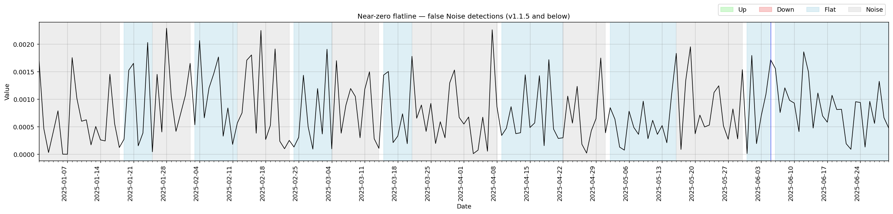

    </div>
    <div class="before-after-panel" markdown>
    <span class="before-after-label after-label">After — v1.1.6</span>

    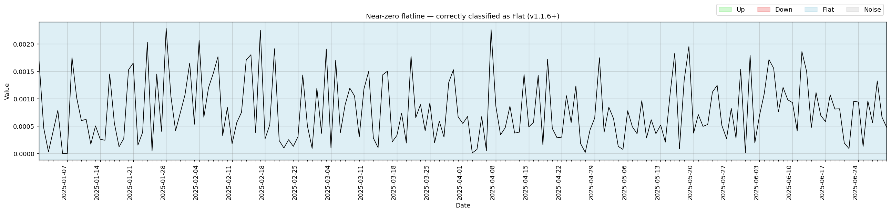

    </div>
    </div>

??? note "v1.1.5 — abrupt shaving infinite loop"
    Fixed an infinite loop in abrupt shaving when a segment was broken into abrupt sub-segments.
    ([#14](https://github.com/RussellSB/pytrendy/issues/14))

??? note "v1.1.4 — noise detection major revamp"
    Trend detection now much less sensitive to noise spikes overall. Introduces DTW-based
    abrupt/noise distinction and more robust spike classification.
    ([#13](https://github.com/RussellSB/pytrendy/issues/13))

    Before the revamp, the algorithm fragmented noisy-but-flat segments into many small
    alternating Noise/Flat bands and missed underlying gradual downtrends. After, it consolidates
    the noise and correctly identifies the downtrend structure.

    <div class="before-after-grid" markdown>
    <div class="before-after-panel" markdown>
    <span class="before-after-label before-label">Before — v1.1.3</span>

    

    </div>
    <div class="before-after-panel" markdown>
    <span class="before-after-label after-label">After — v1.1.4</span>

    

    </div>
    </div>

    Regression test: [`test_noisy_edgecase_3_scenario`](https://github.com/RussellSB/pytrendy/blob/develop/tests/tests_crashes_edgecases/test_noise_edgecases.py)

    ??? example "Code"
        ```python
        import pandas as pd
        import pytrendy as pt

        url = "https://raw.githubusercontent.com/RussellSB/pytrendy/main/tests/tests_crashes_edgecases/data/noisy_edgecases.csv"
        df = pd.read_csv(url)
        pt.detect_trends(df, date_col="date", value_col="noisy_edgecase_3")
        ```

??? note "v1.1.3 — spikes on gradual trends"
    Improved handling of spike segments that sit on top of gradual trends.
    ([#12](https://github.com/RussellSB/pytrendy/issues/12))

    Previously, a single isolated spike in a gradual trend series was expanded into a wide Noise band
    spanning several weeks, masking the surrounding Up/Down structure. After the fix, spikes are
    classified as a tight 1–3 day Noise segment with the gradual trends fully intact on either side.

    <div class="before-after-grid" markdown>
    <div class="before-after-panel" markdown>
    <span class="before-after-label before-label">Before — v1.1.2</span>

    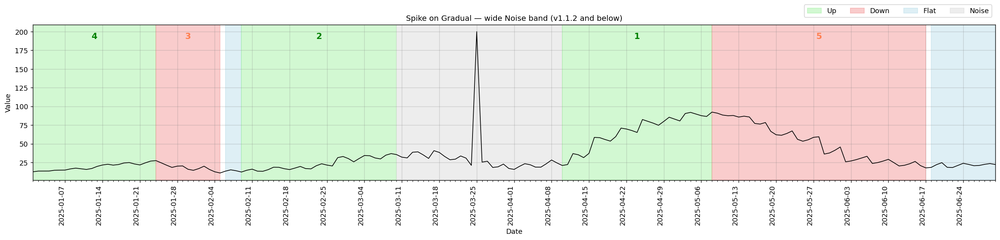

    </div>
    <div class="before-after-panel" markdown>
    <span class="before-after-label after-label">After — v1.1.3</span>

    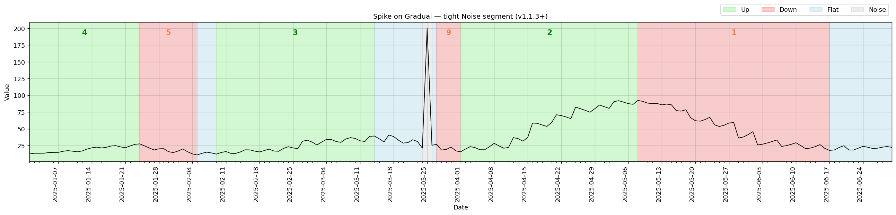

    </div>
    </div>

    Regression test: [`test_gradual_spike_single_mid_series`](https://github.com/RussellSB/pytrendy/blob/develop/tests/test_noise_spikes_gradual.py)

    ??? example "Code"
        ```python
        import pytrendy as pt

        df = pt.load_data("series_synthetic")
        df.set_index("date", inplace=True)
        df.loc["2025-03-25":"2025-03-25", "gradual"] = 200  # inject spike
        df = df.reset_index()
        pt.detect_trends(df, date_col="date", value_col="gradual",
                         method_params=dict(is_abrupt_padded=True))
        ```

---

## Core Engine & Initial Launch (v1.0.x – v1.1.2)

The foundation of PyTrendy — from initial release through the first major engine overhaul
that introduced flat fill-in, a cleaner results API, and comprehensive robustness improvements.

### Released in v1.1.1 and v1.1.2

> v1.1.1 — 2025-10-15 · v1.1.2 — 2025-10-15

Patch releases addressing deployment pipeline issues and a relative-import fix introduced
when v1.1.0 restructured the package layout. No user-facing behaviour changes.
([v1.1.1](https://github.com/RussellSB/pytrendy/releases/tag/v1.1.1) · [v1.1.2](https://github.com/RussellSB/pytrendy/releases/tag/v1.1.2))

---

### Released in v1.1.0

> Released 2025-10-15 — *minor version: new features and major robustness overhaul*

The most significant update to PyTrendy's core engine since the initial launch — new flat fill-in,
a simpler results interface, and a thorough revamp of the signal processing pipeline. ([#8](https://github.com/RussellSB/pytrendy/issues/8))

??? note "Flat fill-in"
    Gaps between classified segments are now automatically filled with a **Flat** segment,
    so the output always covers the full input time range.

    Before this change, those uncovered intervals appeared as white gaps between coloured regions.
    After v1.1.0, they are explicitly represented as blue Flat segments.

    <div class="before-after-grid" markdown>
    <div class="before-after-panel" markdown>
    <span class="before-after-label before-label">Before — v1.0.x</span>

    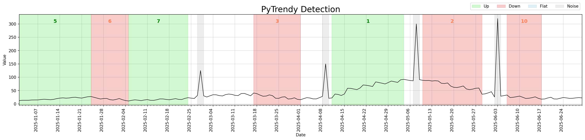

    </div>
    <div class="before-after-panel" markdown>
    <span class="before-after-label after-label">After — v1.1.0</span>

    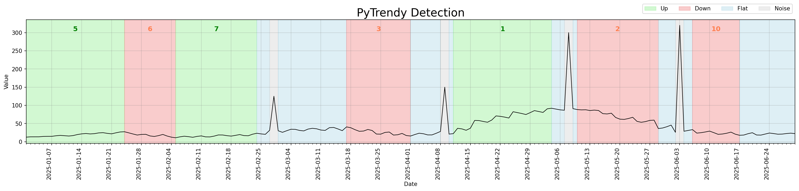

    </div>
    </div>

    Regression test: [`test_gradual_four_spikes_distributed_flatfillins`](https://github.com/RussellSB/pytrendy/blob/develop/tests/test_noise_spikes_gradual.py)

    ??? example "Code"
        ```python
        import pytrendy as pt

        df = pt.load_data("series_synthetic")
        df.set_index("date", inplace=True)
        df.loc["2025-02-28":"2025-02-28", "gradual"] = 125
        df.loc["2025-04-09":"2025-04-09", "gradual"] = 150
        df.loc["2025-05-08":"2025-05-08", "gradual"] = 300
        df.loc["2025-06-03":"2025-06-03", "gradual"] = 320
        df = df.reset_index()

        pt.detect_trends(
            df,
            date_col="date",
            value_col="gradual",
            method_params=dict(is_abrupt_padded=False),
        )
        ```

??? note "Abrupt trend detection — illustrated"
    v1.1.0 introduced `is_abrupt_padded` for the first time, enabling boundary padding so that
    abrupt transitions span their natural width rather than hairline boundaries.
    This unlocks quasi-experiment designs such as Interrupted Time Series Analysis (ITSA),
    where clean pre/post intervention windows are required.

    <div class="before-after-grid" markdown>
    <div class="before-after-panel" markdown>
    <span class="before-after-label before-label">Before — v1.0.x</span>

    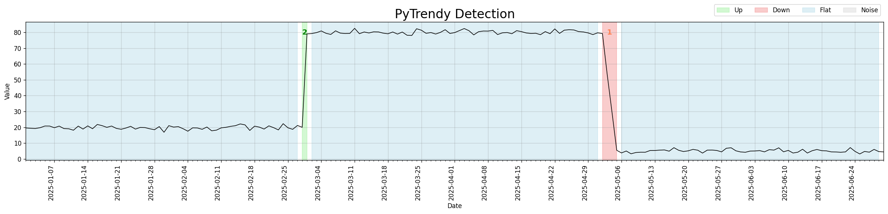

    </div>
    <div class="before-after-panel" markdown>
    <span class="before-after-label after-label">After — v1.1.0</span>

    

    </div>
    </div>

    ??? example "Code"
        ```python
        import pytrendy as pt

        df = pt.load_data("series_synthetic")
        pt.detect_trends(df, date_col="date", value_col="abrupt",
                         method_params=dict(is_abrupt_padded=True))
        ```

??? note "Simplified results interface"
    The `TrendyResults` object gained two shorter access patterns:

    === "Before (v1.0.x)"

        ```python
        segments_df = result.segments_df
        summary_df  = result.summary["df"]
        ```

    === "After (v1.1.0+)"

        ```python
        segments_df = result.df          # shorter alias
        summary_df  = result.df_summary  # direct attribute
        ```

    Both names continue to work in v1.1.x.

??? note "Brown-bug fix"
    Up (green) and Down (red) regions were stacking on top of each other in v1.0.x, blending into a
    brownish artifact. The root cause — abrupt spikes being shaved without direction-awareness — was
    resolved; segments now align directionally before any visual displacement.
    ([b0d1690](https://github.com/RussellSB/pytrendy/commit/b0d1690) · [5509178](https://github.com/RussellSB/pytrendy/commit/5509178))

    <div class="before-after-grid" markdown>
    <div class="before-after-panel" markdown>
    <span class="before-after-label before-label">Before — v1.0.x</span>

    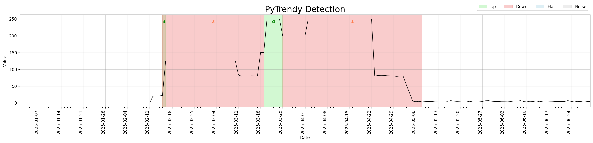

    </div>
    <div class="before-after-panel" markdown>
    <span class="before-after-label after-label">After — v1.1.0</span>

    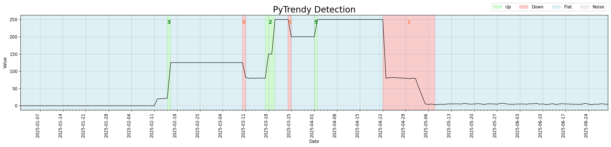

    </div>
    </div>

    ??? example "Code"
        ```python
        import pytrendy as pt

        df = pt.load_data("series_synthetic")
        df.set_index("date", inplace=True)
        df.loc["2025-01-01":"2025-02-11", "abrupt"] = 0
        df.loc["2025-02-16":"2025-03-10", "abrupt"] = 125
        df.loc["2025-03-18":"2025-04-15", "abrupt"] = 150
        df.loc["2025-03-20":"2025-04-22", "abrupt"] = 250
        df.loc["2025-03-25":"2025-04-01", "abrupt"] = 200
        df = df.reset_index()

        pt.detect_trends(
            df,
            date_col="date",
            value_col="abrupt",
            method_params=dict(is_abrupt_padded=False),
        )
        ```

??? note "Other core processing revamp & bug fixes"
    The signal processing and post-processing pipeline was extensively reworked ([#8](https://github.com/RussellSB/pytrendy/issues/8) · [6c53790](https://github.com/RussellSB/pytrendy/commit/6c53790)):

    - More robust handling of edge cases across all trend types.
    - Abrupt detection: better shaving, sub-segmentation, and direction-sensitivity ([c66ed2e](https://github.com/RussellSB/pytrendy/commit/c66ed2e)).
    - Gradual swallowing stretches flexibly across neighbouring segment adjustments ([5f6e2c9](https://github.com/RussellSB/pytrendy/commit/5f6e2c9)).
    - Touching consecutive abrupt segments are now correctly grouped ([50d2f52](https://github.com/RussellSB/pytrendy/commit/50d2f52)).
    - `has_inverse()` now also validates total-change consistency, not just direction ([37411fe](https://github.com/RussellSB/pytrendy/commit/37411fe)).
    - Windows path separators handled correctly in the data loader ([d04c49c](https://github.com/RussellSB/pytrendy/commit/d04c49c)).
    - `detect_trends()` is now robust to wide DataFrames containing non-numeric columns ([a7c286d](https://github.com/RussellSB/pytrendy/commit/a7c286d)).
    - Fixed a crash when no segments are detected ([a3ac41f](https://github.com/RussellSB/pytrendy/commit/a3ac41f)).

---

### Released in v1.0.x

> August–September 2025 — *initial release*

PyTrendy launched with gradual, abrupt, and flat trend detection in a single call.
([v1.0.0](https://github.com/RussellSB/pytrendy/releases/tag/v1.0.0))

??? note "Gradual trend detection"
    Smooth up and down trends are detected and annotated as Up, Down, and Flat segments out of the
    box with a single call to `detect_trends()`.

    

    ??? example "Code"
        ```python
        import pytrendy as pt

        df = pt.load_data("series_synthetic")
        pt.detect_trends(df, value_col="gradual", date_col="date")
        ```

??? note "Abrupt trend detection"
    Abrupt step-changes in the signal are detected and annotated as Up or Down regions. v1.0.x
    already supported multi-segment abrupt series. Boundary padding (`is_abrupt_padded=True`) was
    not yet available — detections reflect instantaneous precision at the point of change.

    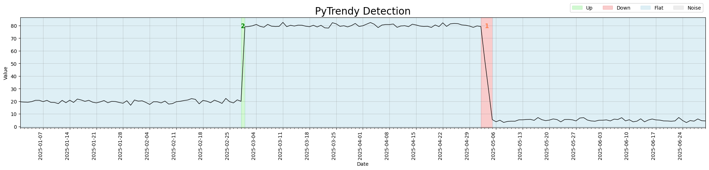

    ??? example "Code"
        ```python
        import pytrendy as pt

        df = pt.load_data("series_synthetic")
        pt.detect_trends(df, date_col="date", value_col="abrupt",
                         method_params=dict(is_abrupt_padded=False))
        ```

??? note "Noise detection — random noise on a gradual trend"
    When the input signal carries moderate random noise layered on top of a gradual trend, the
    algorithm identifies noise segments while still extracting the underlying Up/Down/Flat structure.

    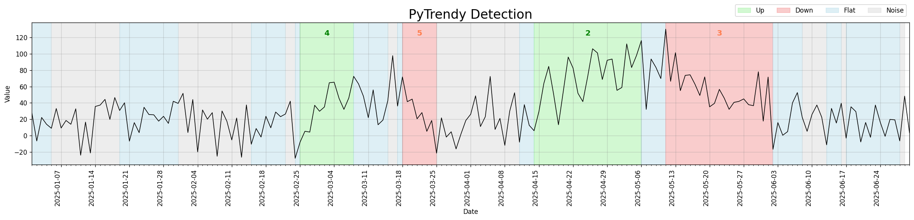

    ??? example "Code"
        ```python
        import pytrendy as pt

        df = pt.load_data("series_synthetic")
        pt.detect_trends(df, date_col="date", value_col="gradual-noisy-20")
        ```

??? note "Noise detection — spikes on a gradual trend"
    Isolated outlier spikes sitting on top of a smooth gradual trend are classified as short Noise
    segments, leaving the surrounding Up/Down structure intact.

    *This was the initial implementation of spike detection in v1.0.x. Subsequent versions (v1.1.3,
    v1.1.4, v1.1.7) targeted significant precision improvements — reducing over-wide Noise bands and
    better distinguishing spike outliers from sustained noise regions.*

    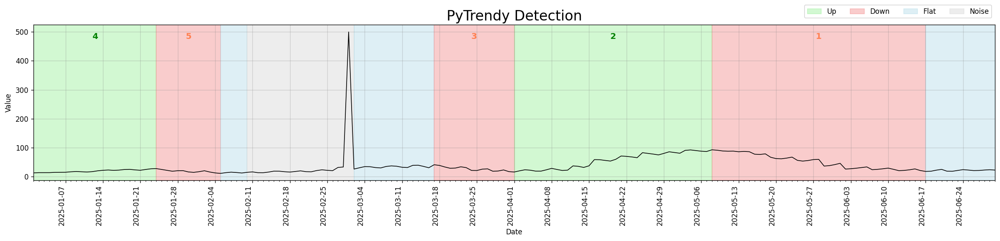

    ??? example "Code"
        ```python
        import pytrendy as pt

        df = pt.load_data("series_synthetic")
        df.set_index("date", inplace=True)
        df.loc["2025-03-01":"2025-03-01", "gradual"] = 500  # inject spike
        df = df.reset_index()
        pt.detect_trends(df, date_col="date", value_col="gradual")
        ```

<!-- WHATS_NEW_CONTENT_END -->
