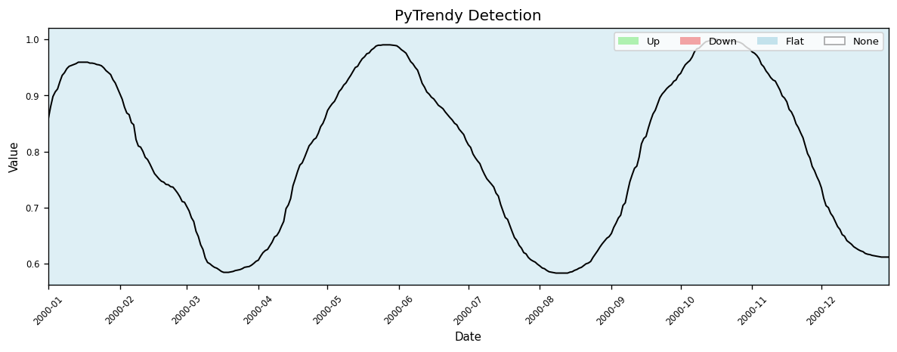
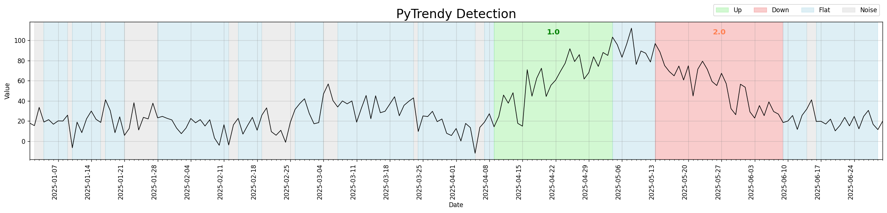
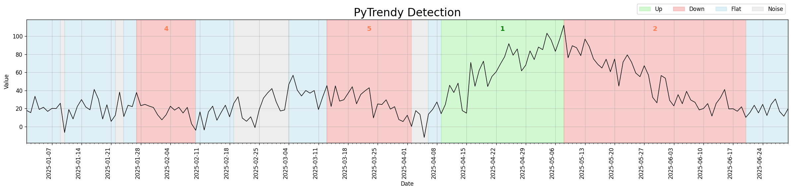
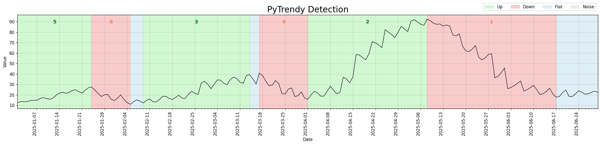
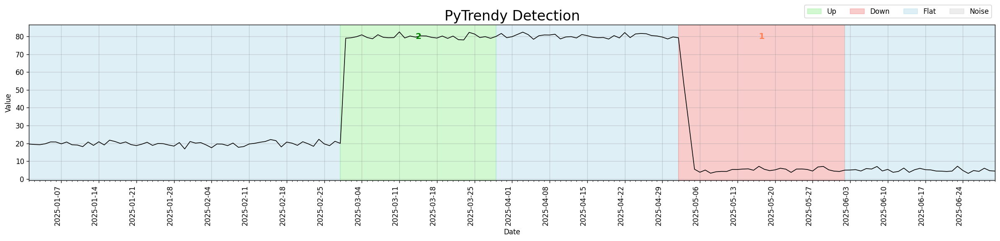

# What's New

Stay up to date with every PyTrendy release — user-facing improvements, bug fixes, and behaviour changes.

!!! note "Pre-release documentation"
    You are viewing the **develop** (pre-release) build.  
    The section at the top reflects changes staged for the next stable release.  
    Switch to the **main** docs via the badge in the header to see only stable content.

---

<!-- WHATS_NEW_CONTENT_START -->

## Upcoming Changes (v1.1.11 pre-release) <span class="version-prerelease">in development</span>

*Staged on the `develop` branch — will land in the next stable release.*

Two fixes to trend metrics and normalised input handling.

??? note "Trend detection on normalised time series"
    `detect_trends()` previously returned an empty result when the input signal was scaled to the
    `[0, 1]` range (e.g., after min-max normalisation). The absolute detection threshold was too large
    relative to the signal amplitude.

    <div class="before-after-grid" markdown>
    <div class="before-after-panel" markdown>
    <span class="before-after-label before-label">Before — v1.1.10</span>

    

    </div>
    <div class="before-after-panel" markdown>
    <span class="before-after-label after-label">After — v1.1.11</span>

    

    </div>
    </div>

    The same normalised series now returns a correctly detected Up / Flat / Down sequence.
    Regression test: [`test_low_value_series`](https://github.com/RussellSB/pytrendy/blob/develop/tests/tests_crashes_edgecases/test_uncommon_values.py)

    ??? example "Code"
        ```python
        import pandas as pd
        import pytrendy as pt

        url = "https://raw.githubusercontent.com/RussellSB/pytrendy/develop/tests/tests_crashes_edgecases/data/low_value_series.csv"
        df = pd.read_csv(url)
        result = pt.detect_trends(df, date_col="date", value_col="trend")
        print(result.df[["start", "end", "direction"]])
        ```

??? note "Metrics for all segment types"
    Segment metrics (`pct_change`, `change_rank`) were not computed for every trend type.
    All output rows now carry complete metric columns regardless of classification.
    Fix: [#88](https://github.com/RussellSB/pytrendy/issues/88)

---

## Noise Detection & Robustness (v1.1.3 – v1.1.10)

A sustained series of improvements to noise detection, spike precision, and edge-case
stability — making the algorithm significantly more reliable on real-world noisy signals.

### Released in v1.1.10

> Released 2026-03-21

Comprehensive automated tests added for noise edge cases and crash scenarios — full coverage for the noise detection module. ([#46](https://github.com/RussellSB/pytrendy/issues/46))

??? note "Details"
    - Automated tests for noise crashes (`test_noise_crashes.py`) and edge cases (`test_noise_edgecases.py`).
    - Artefact-cleaning helpers refactored to be more testable and deterministic.
    - Several `pytest-mpl` baseline images corrected.

---

### Released in v1.1.8 and v1.1.9

> v1.1.8 — 2025-11-15 · v1.1.9 — 2026-02-07

Targeted improvements to noise detection precision and flat segment handling. ([v1.1.9: #42](https://github.com/RussellSB/pytrendy/issues/42))

??? note "Flat fill-in (v1.1.8)"
    - Covers regions that fall outside any detected segment range, eliminating visual white gaps.
    - Correctly skips zero-day leading/trailing regions and handles grouped segments.

??? note "Noise detection (v1.1.8)"
    - Better precision for a spike on an otherwise flat-zero signal.
    - Improved sensitivity when flat conversions emerge from noisy gradual trends.
    - `trend_too_flat` now treated as a flat conversion rather than noise.
    - Up/down classification uses the actual signal (not the smoothed derivative), reducing downstream artefact-cleaning needs.
    - Gradual trends enclosed in noise are handled more leniently.
    - Noise adjustment for contract logic now crops correctly before start/end boundary checks.

??? note "Spike precision (v1.1.9)"
    Further improvement to spike detection precision for signals with a single dominant outlier surrounded by otherwise stable values. ([#42](https://github.com/RussellSB/pytrendy/issues/42))

---

### Released in v1.1.3 – v1.1.7

> v1.1.3 — 2025-10-16 · v1.1.4 — 2025-10-19 · v1.1.5 — 2025-10-22 · v1.1.6 — 2025-10-23 · v1.1.7 — 2025-11-01

A focused series of noise detection improvements, from an initial major revamp through to edge-case tuning and stability fixes.

??? note "v1.1.7 — expand-contract & noise stability"
    - **Expand-contract:** gradual trends can now be retroactively updated when a newer gradual changes the reference baseline.
    - **Noise detection:** resolved edge cases around abrupt-noise boundaries, opposite-direction overlaps, and post-grouping validity checks.
    - **Plot:** visual displacement is only applied when it does not break the up/down direction contract.

??? note "v1.1.6 — noise threshold tuning"
    Made the noise threshold slightly less sensitive to avoid false positives on near-zero signals.
    ([#16](https://github.com/RussellSB/pytrendy/issues/16))

??? note "v1.1.5 — abrupt shaving infinite loop"
    Fixed an infinite loop in abrupt shaving when a segment was broken into abrupt sub-segments.
    ([#14](https://github.com/RussellSB/pytrendy/issues/14))

??? note "v1.1.4 — noise detection major revamp"
    Trend detection now much less sensitive to noise spikes overall. Introduces DTW-based
    abrupt/noise distinction and more robust spike classification.
    ([#13](https://github.com/RussellSB/pytrendy/issues/13))

    Before the revamp, the algorithm fragmented noisy-but-flat segments into many small
    alternating Noise/Flat bands and missed underlying gradual downtrends. After, it consolidates
    the noise and correctly identifies the downtrend structure.

    <div class="before-after-grid" markdown>
    <div class="before-after-panel" markdown>
    <span class="before-after-label before-label">Before — v1.1.3</span>

    

    </div>
    <div class="before-after-panel" markdown>
    <span class="before-after-label after-label">After — v1.1.4</span>

    

    </div>
    </div>

    Regression test: [`test_noisy_edgecase_3_scenario`](https://github.com/RussellSB/pytrendy/blob/develop/tests/tests_crashes_edgecases/test_noise_edgecases.py)

    ??? example "Code"
        ```python
        import pandas as pd
        import pytrendy as pt

        url = "https://raw.githubusercontent.com/RussellSB/pytrendy/main/tests/tests_crashes_edgecases/data/noisy_edgecases.csv"
        df = pd.read_csv(url)
        pt.detect_trends(df, date_col="date", value_col="noisy_edgecase_3")
        ```

??? note "v1.1.3 — spikes on gradual trends"
    Improved handling of spike segments that sit on top of gradual trends.
    ([#12](https://github.com/RussellSB/pytrendy/issues/12))

---

## Core Engine & Initial Launch (v1.0.x – v1.1.2)

The foundation of PyTrendy — from initial release through the first major engine overhaul
that introduced flat fill-in, a cleaner results API, and comprehensive robustness improvements.

### Released in v1.1.0

> Released 2025-10-15 — *minor version: new features and major robustness overhaul*

The most significant update to PyTrendy's core engine since the initial launch — new flat fill-in,
a simpler results interface, and a thorough revamp of the signal processing pipeline. ([#8](https://github.com/RussellSB/pytrendy/issues/8))

??? note "Flat fill-in"
    Gaps between classified segments are now automatically filled with a **Flat** segment,
    so the output always covers the full input time range.

??? note "Gradual trend detection — illustrated"
    <figure markdown>
      
      <figcaption>Gradual uptrend, flat, and downtrend — correctly classified over the full series.</figcaption>
    </figure>

    ??? example "Code"
        ```python
        import pytrendy as pt

        df = pt.load_data("series_synthetic")
        pt.detect_trends(df, date_col="date", value_col="gradual")
        ```

??? note "Abrupt trend detection — illustrated"
    In v1.0.x, detected abrupt step-changes had very narrow boundaries (sometimes just 1–3 days).
    v1.1.0 introduces smarter shaving and optional padding so transitions span their natural width.

    <div class="before-after-grid" markdown>
    <div class="before-after-panel" markdown>
    <span class="before-after-label before-label">Before — v1.0.x</span>

    

    </div>
    <div class="before-after-panel" markdown>
    <span class="before-after-label after-label">After — v1.1.0</span>

    

    </div>
    </div>

    ??? example "Code"
        ```python
        import pytrendy as pt

        df = pt.load_data("series_synthetic")
        pt.detect_trends(df, date_col="date", value_col="abrupt",
                         method_params=dict(is_abrupt_padded=True))
        ```

??? note "Simplified results interface"
    The `TrendyResults` object gained two shorter access patterns:

    === "Before (v1.0.x)"

        ```python
        segments_df = result.segments_df
        summary_df  = result.summary["df"]
        ```

    === "After (v1.1.0+)"

        ```python
        segments_df = result.df          # shorter alias
        summary_df  = result.df_summary  # direct attribute
        ```

    Both names continue to work in v1.1.x.

??? note "Core processing revamp"
    The signal processing and post-processing pipeline was extensively reworked ([#8](https://github.com/RussellSB/pytrendy/issues/8)):

    - More robust handling of edge cases across all trend types.
    - Abrupt detection: better shaving, sub-segmentation, and direction-sensitivity.
    - Gradual swallowing stretches flexibly across neighbouring segment adjustments.
    - Touching consecutive abrupt segments are now correctly grouped.
    - `has_inverse()` now also validates total-change consistency, not just direction.
    - Windows path separators handled correctly in the data loader.
    - `detect_trends()` is now robust to wide DataFrames containing non-numeric columns.
    - Fixed a crash when no segments are detected.

---

### Released in v1.1.1 and v1.1.2

> v1.1.1 — 2025-10-15 · v1.1.2 — 2025-10-15

Patch releases addressing deployment pipeline issues and a relative-import fix introduced
when v1.1.0 restructured the package layout. No user-facing behaviour changes.

---

### Released in v1.0.x

> August–September 2025 — *initial release*

PyTrendy launched with gradual, abrupt, and flat trend detection in a single call.

<figure markdown>
  
  <figcaption>Out-of-the-box annotated chart from <code>detect_trends()</code>.</figcaption>
</figure>

??? example "Code"
    ```python
    import pytrendy as pt

    df = pt.load_data("series_synthetic")
    pt.detect_trends(df, value_col="gradual", date_col="date")
    ```

<!-- WHATS_NEW_CONTENT_END -->
